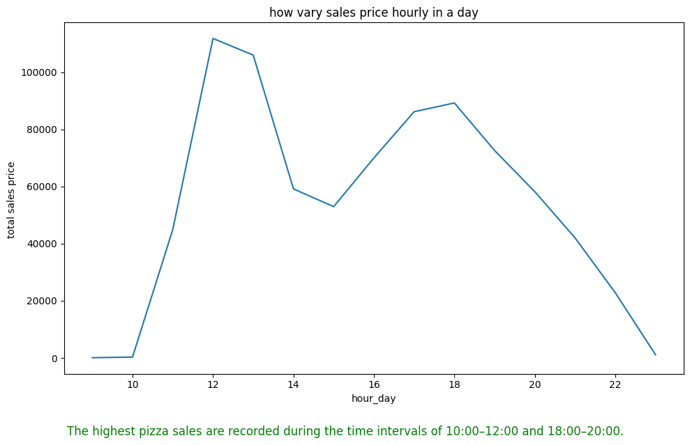
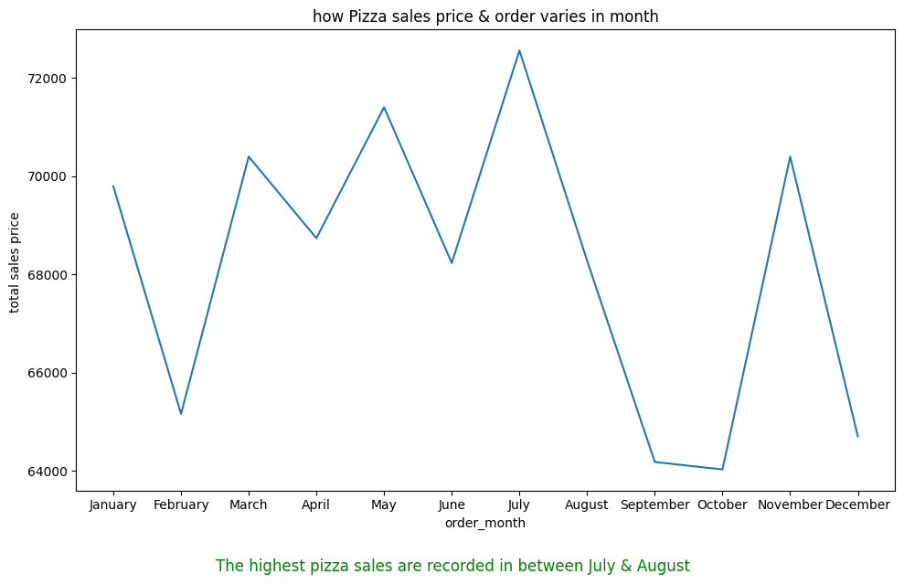
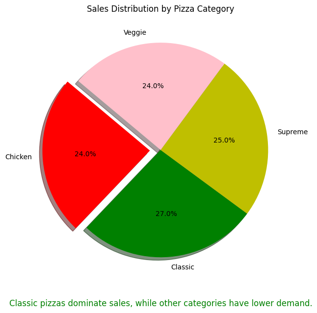
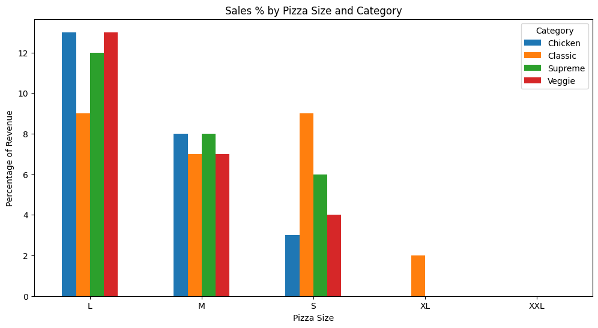
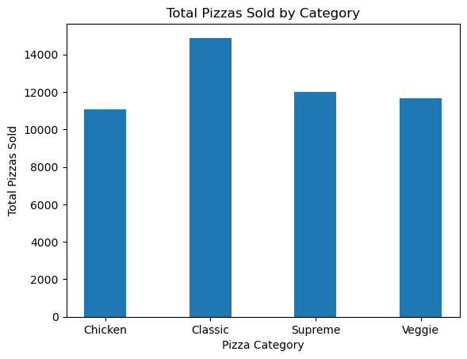
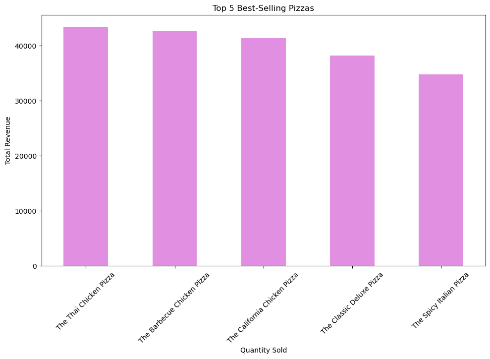
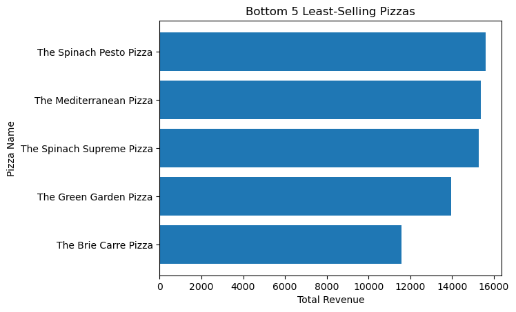

 # *Business Requirements Document (BRD) *

## *Project: Pizza Sales Analysis*

### **Project Overview **
new change

The Pizza Sales Analysis project is designed to analyse transactional sales data from a pizza store. The goal is to identify key business insights, trends, and KPIs that will help management make informed decisions related to sales, marketing, and operations. 
 
Business Objectives 

Identify overall revenue,total pizzas sold, and total number of orders. 
Determine sales distribution by pizza category, size, and type. 
Analyse time-based trends in sales (daily, monthly, and yearly). 
Highlight best-selling and least-selling pizzas by revenue and quantity. 
Understand customer purchasing behaviour through Average Order Value (AOV) and Average Pizza per Order. 
Provide visualization dashboards for effective decision-making. 

 
Data Source & Description 
Dataset: pizza_sales.csv 
Key fields: 

order_id → Unique identifier for each order 

pizza_id → Unique identifier for each pizza 

pizza_name → Name of the pizza sold 

quantity → Number of pizzas sold per order 

total_price → Total revenue for each transaction 

date, time → Order timestamp for time-based analysis 

pizza_category, pizza_size → Attributes for pizza classification 

**Question number 1**

Key Performance Indicators (KPIs) 

Total Revenue = Sum of total_price 

Total Pizzas Sold = Sum of quantity 

Total Orders = Count of unique order_id 

Average Order Value (AOV) = Total Revenue ÷ Total Orders 

Average Pizza per Order = Total Pizzas Sold ÷ Total Orders 

 
Analysis & Visualizations 

Ingredient Analysis 

The pizza business aims to understand which ingredients are most frequently used across different pizza types. By identifying the most common ingredients, the store can 

### 2. Frequency of Pizza Ingredients

 
**Question number 2**

A line/bar chart showing sales by day of the week. 
Useful for staffing and operations planning. 

 

 **Question number 3**

 
Hourly Trend 
A line/bar chart showing sales by hour of the day. 
Useful for staffing, ingredients, customer rush and operations planning 

### 3. Hourly Sales Variation

 **Question number 4**
            
Monthly Trend 
A line chart depicting monthly revenue and orders. 
Helps track seasonality and identify peak sales months. 
Summer months show higher sales due to promotional campaigns. 

### 4. Monthly Sales Variation

**Question number 5**

% of Sales by Category 
A bar chart representing revenue and quantity sold for each pizza category (Classic, Supreme, Veggie, Chicken). 
Helps identify customer preferences. 
Classic pizzas dominate sales, while Veggie has lower demand. 

### 5. Percentage of Pizza sales by Category

**Question number 6**

% Sales by Pizza Size & Category 

A bar/ donut chart comparing sales revenue and quantity by pizza size (S, M, L, XL). 
Highlights demand distribution by size and assist inventory planning. 
Large (L) pizzas contribute the highest revenue. 

 ### 6. Revenue Distribution by Pizza Size

 **Question number 7**

 
Total Pizzas Sold by Pizza Category 
Manage inventory by stocking ingredients used in the most popular categories. 
Evaluate if low-performing categories should be optimized, redesigned, or discontinued. 

  ### 7. Percentage of Pizza by Category

 **Question number 8**

 
Top 5 Best-Selling Pizzas 
A horizontal bar chart showing pizzas with the highest sales (by revenue, orders or quantity). 
Supports promotional and menu strategy. 

### 8.Top_5_best-Selling Pizzas

 **Question number 9**

 
Bottom 5 Least-Selling Pizzas 
A horizontal bar chart of pizzas with the lowest sales. 
Identifies products for improvement or possible removal from the menu. 
 
 ### 9.Bottom 5 Least-Selling Pizzas

 **Question number 10**

 
Business Questions Answered 
What is the total revenue generated? 
How many pizzas were sold in total? 
Which category and size of pizzas perform best? 
Which pizzas are the top and bottom performers? 
What is the average order value and average pizzas per order? 
What are the sales trends by day, month, and time of day? 
 
 
 
**Deliverables **

Jupyter Notebook with complete Python analysis. 
Visualizations (bar charts, line charts, trend charts). 
Business Requirements Document (BRD). 
Insights and recommendations for management. 

 
**Conclusion & Recommendations **

The analysis provides a comprehensive view of pizza sales performance. Management can leverage these insights to: 
Focus marketing on high-performing categories. 
Optimize the menu by reconsidering least-selling pizzas. 
Plan inventory and staffing based on sales peaks. 
Monitor KPIs regularly through dashboards for continuous improvement. 
 

